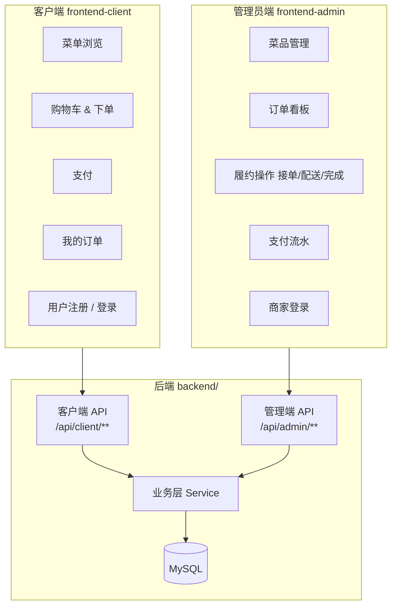
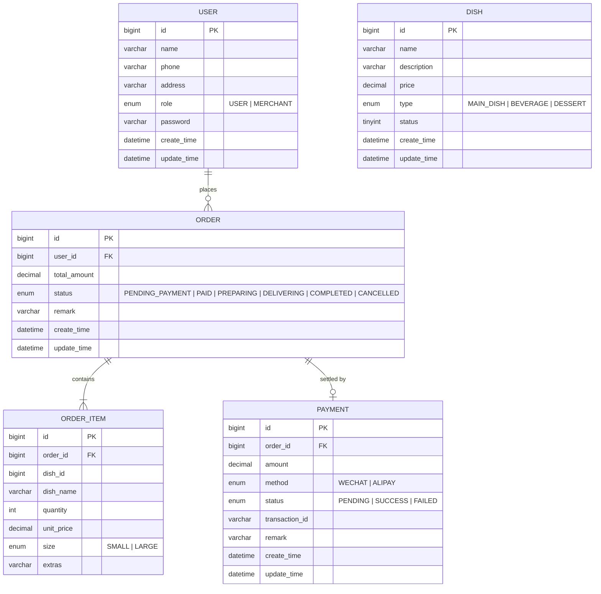

# OrderSys 管理员端与客户端拆分设计文档

> 版本：v1.0  
> 日期：2026-06-19  
> 状态：设计草稿

---

## 目录

1. [现状分析](#1-现状分析)
2. [拆分目标与边界](#2-拆分目标与边界)
3. [功能归属矩阵](#3-功能归属矩阵)
4. [前端拆分方案](#4-前端拆分方案)
5. [后端改造方案](#5-后端改造方案)
6. [数据模型变更](#6-数据模型变更)
7. [拆分路线图](#7-拆分路线图)
8. [目录结构对比](#8-目录结构对比)

---

## 1. 现状分析

### 1.1 整体架构

OrderSys 当前是一个标准的**前后端分离单体**项目：

```
browser (port 5173)
    └── frontend/         Vue 3 + Vite，统一管理后台
          └── /api proxy
backend/ (port 8080)     Spring Boot 3 + MyBatis-Plus
    └── MySQL (port 3306)
```

### 1.2 问题：角色边界模糊

当前前端 `frontend/` 是单一应用，4 个视图混合了两种用户角色的操作：

| 视图文件 | 包含的客户端操作 | 包含的管理员操作 |
|----------|----------------|----------------|
| `OrderView.vue` | 下单、发起支付、取消订单 | 查看全部订单看板、接单、配送、完成 |
| `DishView.vue` | 浏览菜品列表 | 新增菜品、菜品管理 |
| `UserView.vue` | 注册账号 | （全部属于管理操作） |
| `PaymentView.vue` | 查询自己的支付记录 | 查询任意订单支付流水 |

`OrderTicket.vue` 组件最为典型，它同时渲染客户操作按钮（"去支付"）和商家操作按钮（"接单"、"开始配送"、"完成订单"），任何打开页面的人都可以执行所有操作：

```vue
<!-- 现状：同一个组件，所有人都能看到所有按钮 -->
<button v-if="order.status === 'PENDING_PAYMENT'">💳 去支付</button>  <!-- 客户操作 -->
<button v-if="order.status === 'PAID'">✓ 接单</button>                <!-- 管理员操作 -->
<button v-if="order.status === 'PREPARING'">🚴 开始配送</button>      <!-- 管理员操作 -->
<button v-if="order.status === 'DELIVERING'">✓ 完成订单</button>      <!-- 管理员操作 -->
```

### 1.3 后端现状

- **无认证/鉴权**：所有 API 均无 Token 校验，任何人可调用任意接口
- **无角色字段**：`user` 表只有 `name`、`phone`、`address`，无法区分普通用户与商家
- **无数据隔离**：`GET /api/order` 返回全部订单，客户可以看到其他人的订单

---

## 2. 拆分目标与边界



### 2.1 管理员端（B 端）定义

- **使用者**：餐厅/商家运营人员
- **核心职责**：菜品上下架、订单履约（接单→配送→完成）、支付对账
- **访问方式**：内网或受控 URL，需商家账号登录
- **技术形态**：独立 Vite 应用 `frontend-admin/`，运行在不同端口或子域名

### 2.2 客户端（C 端）定义

- **使用者**：点餐用户（顾客）
- **核心职责**：浏览菜单、下单、支付、查看自己的订单状态
- **访问方式**：公开 URL，用户账号登录
- **技术形态**：独立 Vite 应用 `frontend-client/`，移动端优先设计

---

## 3. 功能归属矩阵

### 3.1 前端视图与组件

| 现有文件 | 现有功能点 | 拆分归属 | 处理方式 |
|----------|-----------|---------|---------|
| `OrderView.vue` | 新建订单 | **客户端** | 迁移到 `frontend-client/` |
| `OrderView.vue` | 发起支付 | **客户端** | 迁移到 `frontend-client/` |
| `OrderView.vue` | 取消订单（用户发起） | **客户端** | 迁移到 `frontend-client/` |
| `OrderView.vue` | 全部订单看板 | **管理员端** | 迁移到 `frontend-admin/` |
| `OrderView.vue` | 接单 / 配送 / 完成 | **管理员端** | 迁移到 `frontend-admin/` |
| `DishView.vue` | 菜品列表浏览 | **客户端** | 在 `frontend-client/` 重建为点餐菜单 |
| `DishView.vue` | 新增/管理菜品 | **管理员端** | 迁移到 `frontend-admin/` |
| `UserView.vue` | 用户注册 | **客户端** | 迁移到 `frontend-client/` 注册页 |
| `PaymentView.vue` | 查询自己的支付 | **客户端** | 迁移到 `frontend-client/` 订单详情页 |
| `PaymentView.vue` | 全部支付流水 | **管理员端** | 迁移到 `frontend-admin/` |
| `OrderTicket.vue` | 去支付按钮 | **客户端** | 在 `frontend-client/` 重建（保留支付逻辑） |
| `OrderTicket.vue` | 接单/配送/完成按钮 | **管理员端** | 在 `frontend-admin/` 重建（保留操作逻辑） |

### 3.2 后端 API

| 方法 | 路径 | 现状 | 拆分后归属 | 备注 |
|------|------|------|-----------|------|
| POST | `/api/user` | 无鉴权 | `/api/client/auth/register` | 用户自助注册 |
| POST | `/api/auth/login` | **不存在** | `/api/client/auth/login` | **新增** |
| POST | `/api/admin/auth/login` | **不存在** | `/api/admin/auth/login` | **新增** |
| GET  | `/api/user/{id}` | 无鉴权 | `/api/client/user/me` | 改为读取当前登录用户 |
| POST | `/api/dish` | 无鉴权 | `/api/admin/dish` | 仅管理员可创建菜品 |
| GET  | `/api/dish` | 无鉴权 | `/api/client/dish`（公开）+ `/api/admin/dish` | 客户端只看上架菜品 |
| GET  | `/api/dish/{id}` | 无鉴权 | `/api/client/dish/{id}` | 公开接口 |
| POST | `/api/order` | 无鉴权 | `/api/client/order` | 需客户端 Token |
| GET  | `/api/order` | 返回全部 | `/api/client/order`（仅自己）+ `/api/admin/order`（全部） | **数据隔离** |
| GET  | `/api/order/{id}` | 无鉴权 | `/api/client/order/{id}` + `/api/admin/order/{id}` | 按角色校验归属 |
| PUT  | `/api/order/{id}/accept` | 无鉴权 | `/api/admin/order/{id}/accept` | 仅管理员 |
| PUT  | `/api/order/{id}/deliver` | 无鉴权 | `/api/admin/order/{id}/deliver` | 仅管理员 |
| PUT  | `/api/order/{id}/complete` | 无鉴权 | `/api/admin/order/{id}/complete` | 仅管理员 |
| PUT  | `/api/order/{id}/cancel` | 无鉴权 | `/api/client/order/{id}/cancel`（限自己）+ `/api/admin/order/{id}/cancel` | 双端均可 |
| POST | `/api/payment` | 无鉴权 | `/api/client/payment` | 需客户端 Token |
| GET  | `/api/payment/order/{orderId}` | 无鉴权 | `/api/client/payment/order/{orderId}`（自己的）+ `/api/admin/payment` | 按角色 |

---

## 4. 前端拆分方案

### 4.1 路由对比

**现有路由（单体 `frontend/`）：**

```
/           → 重定向到 /orders
/dishes     → DishView.vue（菜品管理 + 浏览）
/orders     → OrderView.vue（全部订单 + 下单 + 履约）
/users      → UserView.vue（注册）
/payments   → PaymentView.vue（全部流水）
```

**拆分后 — 管理员端 `frontend-admin/`：**

```
/           → 重定向到 /admin/orders
/admin/login          → 商家登录页（新增）
/admin/orders         → 订单看板（接单/配送/完成）
/admin/dishes         → 菜品管理（新增/上下架/编辑）
/admin/payments       → 支付流水查询
```

**拆分后 — 客户端 `frontend-client/`：**

```
/           → 重定向到 /menu
/login      → 用户登录页（新增）
/register   → 用户注册页（来自 UserView.vue）
/menu       → 菜单页（按类型展示菜品，来自 DishView.vue 浏览部分）
/cart       → 购物车（新增）
/checkout   → 结算 & 下单（来自 OrderView.vue 新建订单部分）
/orders     → 我的订单列表（新增，按 userId 过滤）
/orders/:id → 订单详情 + 支付（来自 OrderTicket.vue 客户端部分）
```

### 4.2 管理员端 `frontend-admin/` 新增视图

| 新视图 | 来源 | 主要功能 |
|--------|------|---------|
| `LoginView.vue` | 新建 | 商家账号登录，获取 JWT |
| `OrderBoardView.vue` | 来自 `OrderView.vue` 中管理部分 | 订单看板、接单/配送/完成 |
| `DishManageView.vue` | 来自 `DishView.vue` 管理部分 | 菜品 CRUD、上下架切换 |
| `PaymentView.vue` | 来自 `PaymentView.vue` 全量部分 | 全部订单的支付流水 |
| `AdminOrderTicket.vue` | 拆分自 `OrderTicket.vue` | 仅含接单/配送/完成/取消按钮 |

### 4.3 客户端 `frontend-client/` 新增视图

| 新视图 | 来源 | 主要功能 |
|--------|------|---------|
| `LoginView.vue` | 新建 | 用户登录 |
| `RegisterView.vue` | 来自 `UserView.vue` | 用户注册 |
| `MenuView.vue` | 来自 `DishView.vue` 浏览部分 | 菜单展示、加入购物车 |
| `CartView.vue` | 新建 | 购物车管理 |
| `CheckoutView.vue` | 来自 `OrderView.vue` 下单部分 | 确认订单、提交 |
| `MyOrdersView.vue` | 新建 | 我的订单列表（仅当前用户） |
| `OrderDetailView.vue` | 来自 `OrderTicket.vue` 客户端部分 | 订单详情、支付、取消 |

### 4.4 Axios 实例改造

两个前端应用各自维护独立的 `api/index.js`，在请求拦截器中附加各自的 Token：

```js
// frontend-admin/src/api/index.js（示意）
http.interceptors.request.use(config => {
  const token = localStorage.getItem('admin_token')
  if (token) config.headers.Authorization = `Bearer ${token}`
  return config
})

// frontend-client/src/api/index.js（示意）
http.interceptors.request.use(config => {
  const token = localStorage.getItem('user_token')
  if (token) config.headers.Authorization = `Bearer ${token}`
  return config
})
```

---

## 5. 后端改造方案

### 5.1 新增认证模块

在 `backend/src/main/java/com/ordersys/` 下新增 `auth/` 包：

```
auth/
├── AuthController.java       # POST /api/client/auth/login
│                             # POST /api/admin/auth/login
│                             # POST /api/client/auth/register
├── AuthService.java
├── dto/
│   ├── LoginRequest.java
│   ├── RegisterRequest.java
│   └── AuthResponse.java     # { token, userId, role }
└── JwtUtil.java              # JWT 签发与校验
```

推荐依赖：`io.jsonwebtoken:jjwt-api`（已成熟，兼容 Spring Boot 3）

### 5.2 Spring Security 过滤链

添加 `spring-boot-starter-security` 依赖，配置两条过滤链：

```
/api/client/auth/**    → 公开（注册/登录）
/api/client/dish       → 公开（菜单浏览）
/api/client/**         → 需要 USER 角色 Token
/api/admin/auth/**     → 公开（商家登录）
/api/admin/**          → 需要 MERCHANT 角色 Token
```

### 5.3 Controller 重组

| 现有 Controller | 拆分为 |
|----------------|--------|
| `UserController` | `client/UserController`（注册/查自己） + `auth/AuthController` |
| `DishController` | `client/DishController`（只读浏览） + `admin/DishController`（CRUD） |
| `OrderController` | `client/OrderController`（下单/取消/查自己） + `admin/OrderController`（全量/履约） |
| `PaymentController` | `client/PaymentController`（支付/查自己） + `admin/PaymentController`（全量流水） |

Service 层逻辑无需大幅改动，Controller 层主要处理鉴权校验与数据过滤。

### 5.4 订单数据隔离

`OrderService.listOrders()` 增加按角色过滤的重载：

```java
// 管理员：返回全部订单
public List<Order> listOrders(String status) { ... }

// 客户端：仅返回当前用户的订单
public List<Order> listOrdersByUser(Long userId, String status) { ... }
```

---

## 6. 数据模型变更

### 6.1 `user` 表新增 `role` 字段

```sql
ALTER TABLE `user`
  ADD COLUMN `role`     ENUM('USER', 'MERCHANT') NOT NULL DEFAULT 'USER' AFTER `address`,
  ADD COLUMN `password` VARCHAR(100) NOT NULL DEFAULT '' AFTER `role`;
```

- `role = 'USER'`：普通点餐用户
- `role = 'MERCHANT'`：商家管理员
- `password`：存储 BCrypt 哈希值，不存明文

### 6.2 `payment` 表新增备注字段（可选）

```sql
ALTER TABLE `payment`
  ADD COLUMN `remark` VARCHAR(200) AFTER `transaction_id`;
```

### 6.3 拆分后 ER 图



---

## 7. 拆分路线图

拆分分三个阶段推进，每个阶段可独立上线、可回滚。

### Phase 1 — 后端加认证与角色（约 3 天）

**目标**：在不改动现有 Controller 路径的前提下，增加认证基础设施，为 Phase 2 铺路。

- [ ] `user` 表添加 `role`、`password` 字段，更新种子数据
- [ ] 新增 `auth/` 包：`AuthController`、`AuthService`、`JwtUtil`
- [ ] 添加 `spring-boot-starter-security` 依赖，配置 JWT 过滤器
- [ ] 为现有 API 统一加上 `@PreAuthorize` 注解（`/api/order/{id}/accept` 等管理员接口只允许 MERCHANT 角色）
- [ ] 登录接口 `POST /api/auth/login` 返回 JWT Token
- [ ] 编写认证相关单元测试

**验收标准**：用错误 Token 调用接口返回 401；普通用户调用管理员接口返回 403；原有业务功能不受影响。

### Phase 2 — 前端按角色分离（约 2 天）

**目标**：在现有单体 `frontend/` 内，用角色判断控制页面与按钮的可见性，无需立即物理拆分。

- [ ] 引入 Pinia store 管理用户角色与 Token（`useAuthStore`）
- [ ] 添加登录页，登录后将 Token 写入 store 并持久化到 `localStorage`
- [ ] 路由守卫：未登录跳转登录页，角色不符跳转 403 页
- [ ] `OrderTicket.vue` 按 `authStore.role` 条件渲染按钮
- [ ] Axios 拦截器自动携带 Token
- [ ] 前端适配 Phase 1 新增的认证错误（401 → 强制登出）

**验收标准**：以普通用户登录只能看到下单/支付/取消；以商家登录可以看到接单/配送/完成。

### Phase 3 — 物理拆分为两个独立应用（约 4 天）

**目标**：将 `frontend/` 拆分为 `frontend-admin/` 和 `frontend-client/`，后端 Controller 同步按 `admin/` 与 `client/` 前缀重组。

- [ ] 创建 `frontend-admin/`：复用/迁移管理员相关视图
- [ ] 创建 `frontend-client/`：新建菜单页、购物车、我的订单等客户端视图
- [ ] 后端 Controller 按 `/api/admin/**` 与 `/api/client/**` 重新分包
- [ ] 更新 `vite.config.js` 的反向代理配置（两个应用各自代理到同一后端）
- [ ] 更新 `docker-compose.yml`，可选增加 Nginx 做反向代理
- [ ] 归档并删除原 `frontend/` 目录
- [ ] 更新 `README.md` 和 `docs/api.md`

**验收标准**：两个应用可独立启动，各自功能完整，无交叉引用。

---

## 8. 目录结构对比

### 拆分前（现状）

```
ordersys/
├── backend/
│   └── src/main/java/com/ordersys/
│       ├── order/         (Controller + Service + 状态模式)
│       ├── payment/       (Controller + Service + 策略模式)
│       ├── product/       (Controller + Service + 工厂模式)
│       └── user/          (Controller + Service)
│
├── frontend/              ← 单体应用，所有角色共用
│   └── src/
│       ├── views/
│       │   ├── OrderView.vue     ← 混合客户端 + 管理员操作
│       │   ├── DishView.vue      ← 混合浏览 + 管理操作
│       │   ├── UserView.vue
│       │   └── PaymentView.vue   ← 混合客户查询 + 管理流水
│       ├── components/
│       │   └── OrderTicket.vue   ← 混合所有角色的操作按钮
│       ├── api/index.js          ← 无 Token，无角色区分
│       └── router/index.js       ← 所有路由公开可访问
│
└── docker/
```

### 拆分后（目标）

```
ordersys/
├── backend/
│   └── src/main/java/com/ordersys/
│       ├── auth/          ← 新增：JWT 认证模块
│       ├── order/
│       │   ├── admin/     ← 新增：AdminOrderController（履约操作）
│       │   └── client/    ← 新增：ClientOrderController（下单/查自己）
│       ├── payment/
│       │   ├── admin/     ← 新增：AdminPaymentController
│       │   └── client/    ← 新增：ClientPaymentController
│       ├── product/
│       │   ├── admin/     ← 新增：AdminDishController（CRUD）
│       │   └── client/    ← 新增：ClientDishController（只读）
│       └── user/
│           └── client/    ← 新增：ClientUserController（注册/查自己）
│
├── frontend-admin/        ← 新增：商家后台（独立 Vite 应用）
│   └── src/
│       ├── views/
│       │   ├── LoginView.vue
│       │   ├── OrderBoardView.vue   ← 订单看板
│       │   ├── DishManageView.vue   ← 菜品管理
│       │   └── PaymentView.vue      ← 支付流水
│       ├── components/
│       │   └── AdminOrderTicket.vue ← 仅含商家操作按钮
│       ├── stores/useAuthStore.js
│       ├── api/index.js             ← 附带商家 Token
│       └── router/index.js          ← 路由守卫，需 MERCHANT 角色
│
├── frontend-client/       ← 新增：用户点餐端（独立 Vite 应用）
│   └── src/
│       ├── views/
│       │   ├── LoginView.vue
│       │   ├── RegisterView.vue
│       │   ├── MenuView.vue         ← 菜单浏览
│       │   ├── CartView.vue         ← 购物车
│       │   ├── CheckoutView.vue     ← 下单结算
│       │   ├── MyOrdersView.vue     ← 我的订单列表
│       │   └── OrderDetailView.vue  ← 订单详情 + 支付
│       ├── stores/useAuthStore.js
│       ├── api/index.js             ← 附带用户 Token
│       └── router/index.js          ← 路由守卫，需 USER 角色
│
├── docker/
│   ├── docker-compose.yml           ← 可选增加 Nginx 服务
│   └── mysql/init.sql               ← 增加 role、password 字段
│
└── docs/
    ├── api.md                        ← 需同步更新 API 路径
    └── split-design.md              ← 本文档
```
