# OrderSys 外卖订单系统
# 设计模式课程设计报告

---

**课程名称：** 软件设计模式  
**项目名称：** OrderSys 外卖订单系统  
**开发技术：** Spring Boot 3 + Vue 3 + MySQL  
**完成日期：** 2026 年 6 月

---

## 摘 要

本课程设计以「外卖订单系统 OrderSys」为载体，在 Spring Boot 后端中落地状态模式、建造者模式、策略模式与工厂模式四种经典 GoF 设计模式，并配套 Vue 3 双端前端（用户点餐端与商家后台），完成从菜品管理、下单、支付到订单履约的完整业务闭环。

报告从 Spring 框架与设计模式的关系出发，阐述系统的分层架构、核心类设计与数据库表设计，并结合开发过程中遇到的认证鉴权、数据库迁移、前端交互等实际问题，给出分析与解决方案。

**关键词：** 设计模式；Spring Boot；状态模式；建造者模式；策略模式；工厂模式；外卖系统

---

## 目 录

1. [引言](#1-引言)
2. [对 Spring 与设计模式的认识](#2-对-spring-与设计模式的认识)
3. [系统需求与总体设计](#3-系统需求与总体设计)
4. [分层架构设计](#4-分层架构设计)
5. [核心类设计与模式应用](#5-核心类设计与模式应用)
6. [数据表设计](#6-数据表设计)
7. [前端应用开发介绍](#7-前端应用开发介绍)
8. [开发中遇到的问题与解决方案](#8-开发中遇到的问题与解决方案)
9. [测试与验证](#9-测试与验证)
10. [总结与体会](#10-总结与体会)

---

## 1. 引言

### 1.1 项目背景

外卖订餐是日常生活中高频使用的互联网服务。一个完整的外卖系统需要同时服务两类角色：**普通用户**负责浏览菜单、下单、支付与跟踪订单；**商家**负责维护菜品、处理订单与查看支付流水。两类角色的操作权限与数据可见范围截然不同，系统必须在架构层面做好隔离。

本课程设计的核心目标并非单纯实现 CRUD 功能，而是**在真实业务场景中运用设计模式**，使代码结构清晰、易于扩展，并体现面向对象设计原则（开闭原则、单一职责原则、依赖倒置原则等）。

### 1.2 设计目标

| 目标 | 说明 |
|------|------|
| 模式落地 | 在订单、支付、菜品三个领域中分别应用一种经典模式 |
| 可扩展性 | 新增订单状态、支付方式、菜品类型时，尽量不改已有代码 |
| 工程完整性 | 包含数据库、后端 API、双端前端，可本地运行演示 |
| 可测试性 | 为各模式编写单元测试，验证行为正确性 |

### 1.3 技术选型

| 层级 | 技术 | 版本 |
|------|------|------|
| 后端框架 | Spring Boot | 3.3 |
| 持久层 | MyBatis-Plus | 3.5 |
| 安全认证 | Spring Security + JJWT | — |
| 数据库 | MySQL | 8.0 |
| 用户端前端 | Vue 3 + Vite + Pinia | — |
| 商家端前端 | Vue 3 + Vite + Pinia | — |
| 运行环境 | Java | 17 |

---

## 2. 对 Spring 与设计模式的认识

### 2.1 设计模式与 Spring 的关系

设计模式（Design Pattern）是面向对象设计中反复出现的问题的**通用解决方案**，最早由 GoF（Gang of Four）在《Design Patterns》一书中归纳为 23 种。它们描述的是**类与对象如何协作**，独立于具体编程语言与框架。

Spring 框架本身在实现层面大量借鉴了设计模式思想，但 Spring 与应用层 GoF 模式处于不同层次：

| 层次 | 含义 | 典型例子 |
|------|------|----------|
| **框架内部模式** | Spring 源码中的结构性/行为性模式 | IoC 容器（工厂）、AOP 代理（代理模式）、`JdbcTemplate`（模板方法） |
| **框架推荐实践** | 使用 Spring 时的惯用写法 | 构造器注入（依赖倒置）、`@Transactional` 声明式事务 |
| **应用层 GoF 模式** | 开发者在业务代码中主动运用的模式 | 本项目的四种模式 |

本课程设计属于第三层：在 Spring Boot 提供的 IoC、事务、Security 等基础设施之上，**主动在领域模型中引入 GoF 模式**，解决具体业务问题。

### 2.2 Spring 框架中常见的设计模式思想

#### （1）控制反转（IoC）与依赖注入（DI）

Spring 通过 `@Component`、`@Service`、`@Autowired`（或构造器注入）管理 Bean 生命周期，将对象的创建与依赖关系交由容器负责。这体现了**依赖倒置原则（DIP）**：高层模块 `OrderService` 依赖 `OrderMapper` 接口，而非具体实现。

本项目中所有 Service、Controller 均通过构造器注入（`@RequiredArgsConstructor` + `final` 字段），保证依赖不可变、便于单元测试 Mock。

#### （2）代理模式与 AOP

Spring AOP 基于动态代理，在方法执行前后织入横切逻辑。`@Transactional` 注解即利用 AOP 在 `createOrder()`、`pay()` 等方法外层自动开启/提交/回滚事务，业务代码无需手写事务管理。

#### （3）模板方法模式

`JdbcTemplate`、`RestTemplate` 等工具类将固定流程（获取连接、执行、释放）封装在父类，将变化点（SQL、回调）留给子类或 Lambda，是模板方法模式的典型体现。本项目使用 MyBatis-Plus 替代 JDBC 模板，但分层思想一致。

#### （4）过滤器链与责任链思想

Spring Security 的 `SecurityFilterChain` 按顺序处理请求，本项目配置了两条过滤链：认证链（`@Order(1)`）与业务 API 链（`@Order(2)`），体现了**责任链**的处理思想——请求依次经过各过滤器，每个过滤器只处理自己职责范围内的问题。

### 2.3 本项目选用的四种 GoF 模式

| 模式 | 类型 | 应用领域 | 要解决的问题 |
|------|------|----------|-------------|
| **状态模式** | 行为型 | 订单状态机 | 不同状态下允许的操作不同，避免 Service 层充斥 if-else |
| **建造者模式** | 创建型 | 订单项组装 | 订单项有份量、加料、备注等多个可选参数，避免构造函数爆炸 |
| **策略模式** | 行为型 | 支付渠道 | 微信、支付宝等支付方式逻辑各异，需独立封装、便于扩展 |
| **工厂模式** | 创建型 | 菜品创建 | 调用方无需关心具体菜品子类，统一校验后入库 |

### 2.4 模式协作关系

四种模式在一条业务链上串联，职责互不侵入：

**图 2-1 四种设计模式协作关系图**

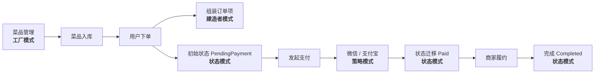

---

## 3. 系统需求与总体设计

### 3.1 功能需求

#### 用户点餐端（C 端）

- 注册、登录（JWT 认证）
- 浏览菜单（分类筛选、关键词搜索）
- 购物车、选择收货地址后下单
- 多地址管理、账户信息维护
- 订单支付（微信 / 支付宝 Mock）、查看与取消

#### 商家后台（B 端）

- 商家登录
- 订单看板（按状态分组，接单 / 配送 / 完成）
- 菜品管理（新增、编辑、上下架、搜索）
- 支付流水查询

### 3.2 非功能需求

- 前后端分离，RESTful API
- 用户与商家 API 路径隔离，JWT 角色鉴权
- 客户端只能访问自己的订单与地址
- 统一 JSON 响应格式 `{ code, message, data }`

### 3.3 总体架构

系统采用经典三层前后端分离架构：

**图 3-1 系统总体架构图**

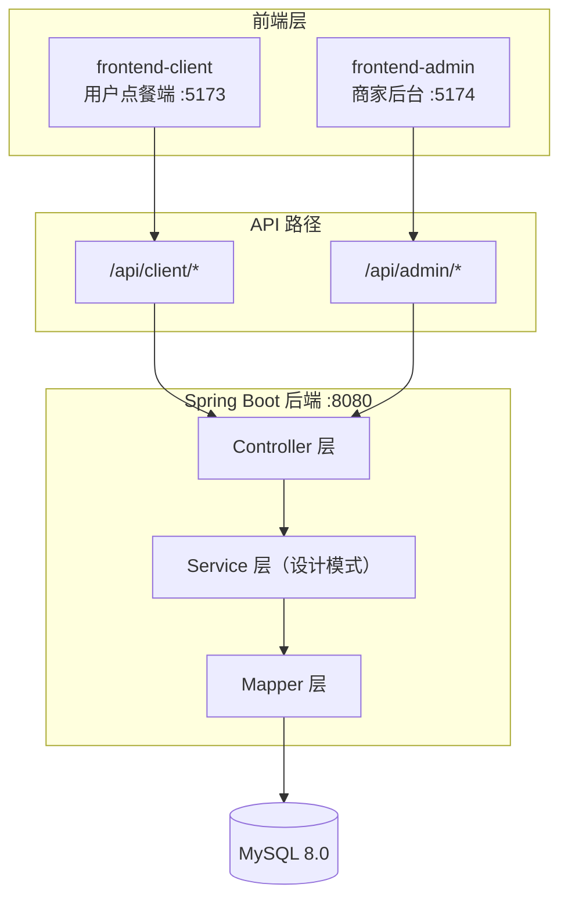

**图 3-2 订单业务时序图**

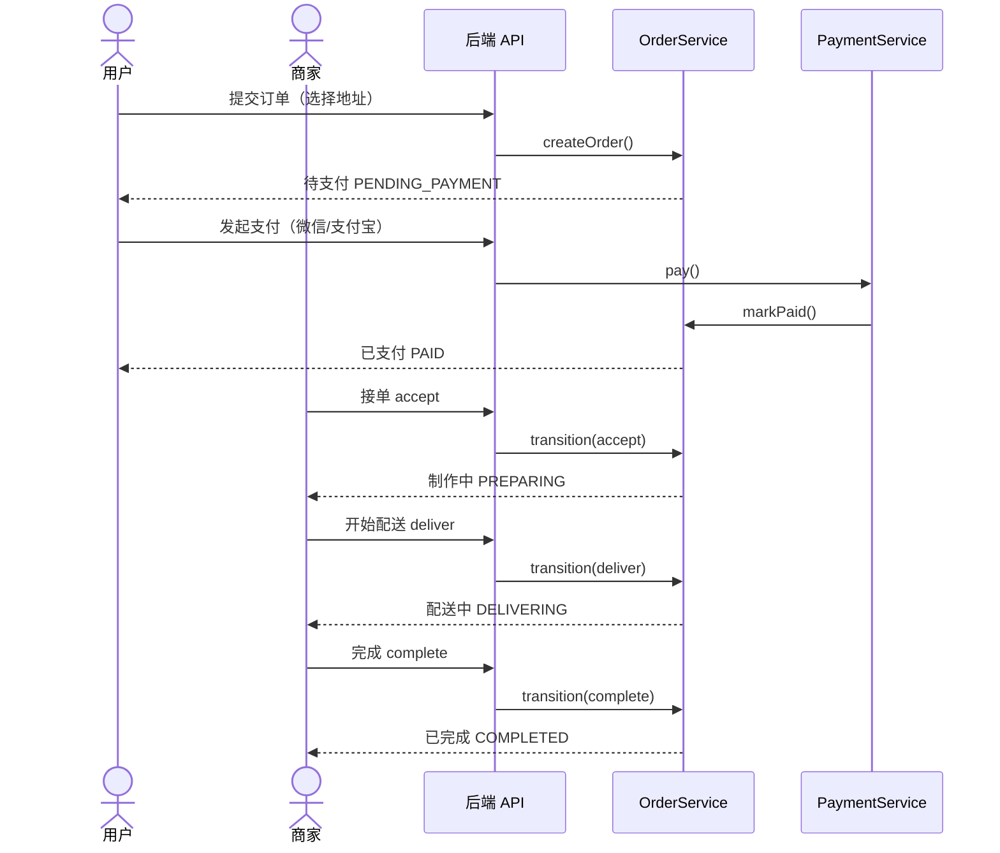

---

## 4. 分层架构设计

### 4.1 后端包结构

后端按**领域（Domain）**划分包，每个领域内再按职责分层：

```
com.ordersys/
├── common/              # 统一响应 Result、全局配置
├── auth/                # JWT 认证（AuthController、JwtFilter、JwtUtil）
├── config/              # SecurityConfig、演示账号初始化
├── order/
│   ├── state/           # ★ 状态模式
│   ├── builder/         # ★ 建造者模式
│   ├── controller/      # AdminOrderController、ClientOrderController
│   ├── service/         # OrderService
│   ├── entity/          # Order、OrderItem
│   └── mapper/          # OrderMapper、OrderItemMapper
├── payment/
│   ├── strategy/        # ★ 策略模式
│   ├── controller/
│   ├── service/
│   ├── entity/
│   └── mapper/
├── product/
│   ├── factory/         # ★ 工厂模式
│   ├── controller/
│   ├── service/
│   ├── entity/
│   └── mapper/
├── user/
│   ├── controller/      # ClientUserController、ClientAddressController
│   ├── service/
│   ├── entity/          # User、UserAddress
│   └── mapper/
└── legacy/              # 旧版 API（过渡期兼容）
```

### 4.2 各层职责

| 层次 | 包/注解 | 职责 | 设计模式所在层 |
|------|---------|------|---------------|
| **表现层** | `controller` | 接收 HTTP 请求，解析 JSON，返回 `Result<T>` | 不直接包含模式逻辑 |
| **业务层** | `service` | 事务边界、流程编排、调用模式对象 | 模式的**编排者** |
| **领域层** | `state` / `builder` / `strategy` / `factory` | 封装核心业务规则 | 模式的**实现者** |
| **持久层** | `mapper` + `entity` | MyBatis-Plus 数据访问 | 状态字段持久化为字符串 |

**关键设计决策：** 设计模式的类放在与 Controller/Service **平级的领域子包**中（如 `order/state/`），而非塞进 Service 内部。这样模式实现可独立测试，Service 只负责「何时调用、如何持久化」。

### 4.3 API 路径与角色隔离

| 路径前缀 | 角色 | 示例 |
|----------|------|------|
| `/api/client/auth/**` | 无需 Token | 注册、用户登录 |
| `/api/admin/auth/**` | 无需 Token | 商家登录 |
| `/api/client/**` | `USER` | 下单、我的订单、地址管理 |
| `/api/admin/**` | `MERCHANT` | 订单看板、菜品管理 |

**图 4-1 后端分层架构图**

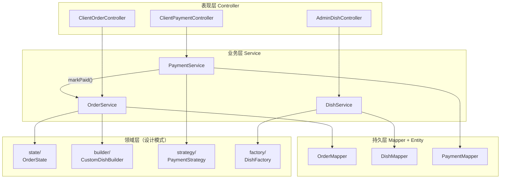

---

## 5. 核心类设计与模式应用

### 5.1 状态模式 — 订单状态机

#### 5.1.1 问题分析

订单在生命周期中经历「待支付 → 已支付 → 制作中 → 配送中 → 已完成」等状态。每个状态下允许的操作不同：

- 「待支付」可以支付、取消，但不能接单
- 「已完成」「已取消」是终态，任何操作都应拒绝

若用 `if-else` 将规则写在 `OrderService` 中，每新增状态或操作都需改动多处，且容易遗漏非法迁移校验。

#### 5.1.2 类设计

```
OrderState（接口）
├── PendingPaymentState   待支付：pay()、cancel()
├── PaidState             已支付：accept()、cancel()
├── PreparingState        制作中：startDelivery()、cancel()
├── DeliveringState       配送中：complete()、cancel()
├── CompletedState        已完成：终态
└── CancelledState        已取消：终态

Order（上下文 Context）
├── state: OrderState     @TableField(exist = false)，不持久化
├── status: String        持久化到数据库
└── setState(s)           同步更新 status 字段
```

**接口设计要点：** `OrderState` 为每个操作提供 `default` 实现，默认抛出 `IllegalStateException`；各具体状态类**只重写自己允许的操作**。

```java
// OrderState.java — 接口 excerpt
default void pay(Order order) {
    throw new IllegalStateException("当前状态[" + getStatusName() + "]不允许支付操作");
}

// PendingPaymentState.java
@Override public void pay(Order order)    { order.setState(new PaidState()); }
@Override public void cancel(Order order) { order.setState(new CancelledState()); }
```

**持久化策略：** 状态对象不写入数据库（`@TableField(exist = false)`），仅持久化 `status` 字符串。从 DB 加载时，由 `OrderService.resolveState()` 根据字符串重建对应状态对象，恢复运行时多态行为。

**服务层编排：**

```java
public Order transition(Long orderId, String action) {
    Order order = getOrderWithState(orderId);
    switch (action) {
        case "accept"   -> order.getState().accept(order);
        case "deliver"  -> order.getState().startDelivery(order);
        case "complete" -> order.getState().complete(order);
        case "cancel"   -> order.getState().cancel(order);
    }
    orderMapper.updateById(order);
    return order;
}
```

注意：`transition()` 中的 `switch` 只做「操作名 → 状态方法」的路由，**不包含任何业务规则**，规则全在状态类内部。

#### 5.1.3 状态迁移表

| 当前状态 | 允许操作 | 目标状态 |
|----------|----------|----------|
| PendingPaymentState | pay, cancel | PaidState, CancelledState |
| PaidState | accept, cancel | PreparingState, CancelledState |
| PreparingState | startDelivery, cancel | DeliveringState, CancelledState |
| DeliveringState | complete, cancel | CompletedState, CancelledState |
| CompletedState | — | 终态 |
| CancelledState | — | 终态 |

**图 5-1 状态模式 UML 类图**

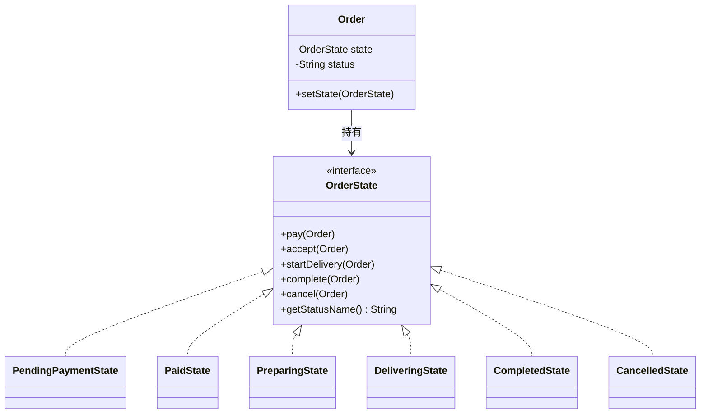

**图 5-2 订单状态迁移图**

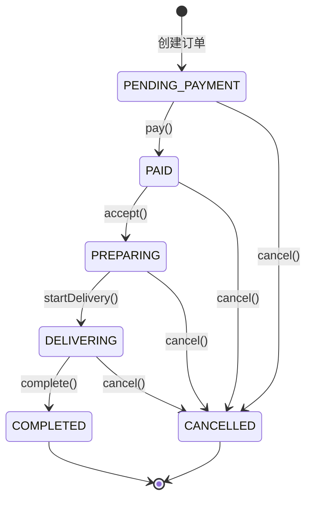

---

### 5.2 建造者模式 — 定制订单项

#### 5.2.1 问题分析

用户下单时，每个菜品可有不同组合：份量（大/小）、加料（加辣、加蛋）、数量、备注。若用多个重载构造函数，会产生**构造函数爆炸**，且难以保证对象一致性。

#### 5.2.2 类设计

```
CustomDishBuilder（建造者）
├── dishId, dishName, unitPrice   必填
├── quantity, size, extras, note  可选，链式设置
└── build() → CustomDish

CustomDish（产品 / 值对象）
├── 全部 final 字段
├── 包私有构造，只能通过 Builder 创建
└── extrasToJson()  序列化加料写入 order_item.extras
```

**使用示例：**

```java
CustomDish dish = new CustomDishBuilder(dishId, name, price)
    .quantity(2)
    .size(Size.LARGE)
    .addExtra("加辣")
    .addExtra("加蛋")
    .note("不要香菜")
    .build();
```

**调用链：** `ClientOrderController` 解析 JSON 请求体 → 组装 `CustomDishBuilder` → `build()` 产出 `CustomDish` 列表 → `OrderService.createOrder()` 计算总价、设置初始状态 `PendingPaymentState`、将快照写入 `order_item`。

**设计收益：**

- 可读性：链式 API 比长参数列表清晰
- 校验前置：`quantity < 1` 在 Builder 阶段即拦截
- 与菜单解耦：`CustomDish` 是订单快照值对象，不映射数据库表，历史订单不受菜单改价影响

**图 5-3 建造者模式 UML 类图**

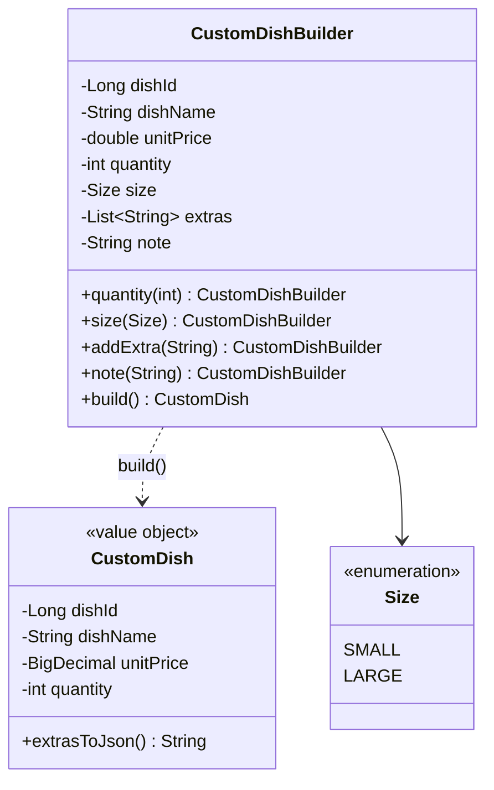

---

### 5.3 策略模式 — 多渠道支付

#### 5.3.1 问题分析

系统需支持微信、支付宝等多种支付方式，各渠道的调用流程、签名规则不同。若将所有逻辑塞进 `PaymentService` 的一个大 `if-else`，每新增渠道都需修改 Service，且难以单独测试。

#### 5.3.2 类设计

```
PaymentStrategy（策略接口）
├── pay(amount, orderId) → PaymentResult
├── getMethodName()
├── WechatPayStrategy    微信 Mock 实现
└── AlipayStrategy       支付宝 Mock 实现

PaymentContext（上下文）
└── pay(amount, orderId)  委托给当前策略

PaymentService
├── 根据 method 选择策略（switch）
├── PaymentContext.pay()
└── 成功后 orderService.markPaid() 桥接状态模式
```

**服务层核心代码：**

```java
PaymentStrategy strategy = switch (method.toUpperCase()) {
    case "WECHAT" -> new WechatPayStrategy();
    case "ALIPAY" -> new AlipayStrategy();
    default -> throw new IllegalArgumentException("不支持的支付方式: " + method);
};
PaymentContext ctx = new PaymentContext(strategy);
PaymentResult result = ctx.pay(amount, orderId);
if (result.isSuccess()) {
    orderService.markPaid(orderId);  // 触发 PendingPaymentState.pay()
}
```

**跨模式桥接：** `PaymentService` 不直接修改 `order.status` 字段，而是通过 `OrderService.markPaid()` 调用状态对象的 `pay()` 方法，由状态模式负责迁移到 `PaidState`。支付层与状态层职责分离。

**图 5-4 策略模式 UML 类图**

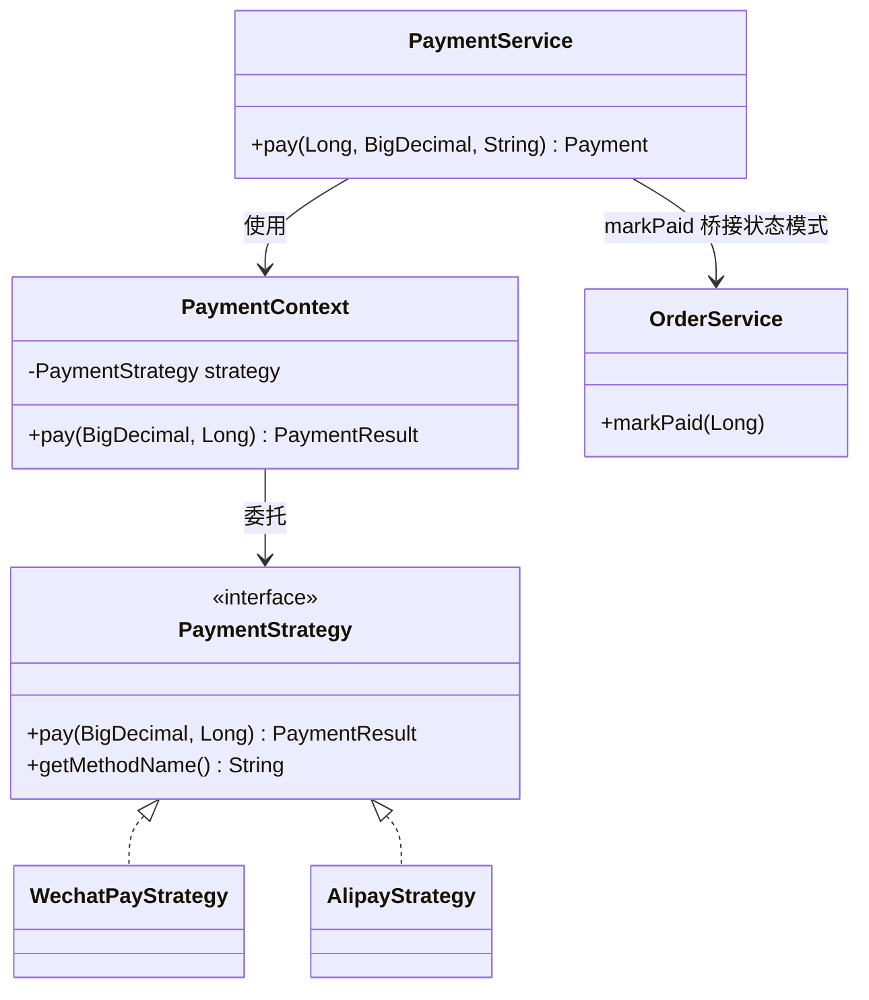

---

### 5.4 工厂模式 — 菜品创建

#### 5.4.1 问题分析

菜品分为主食、饮品、甜点、小吃、小菜、汤品等类型。调用方创建菜品时不应关心具体实例化哪个子类，也不应绕过公共校验逻辑。

#### 5.4.2 类设计

```
AbstractDish（抽象产品）
├── validate()       名称非空、价格 > 0
└── toDishEntity()   转为 MyBatis 实体 Dish

具体产品：
├── MainDish      MAIN_DISH
├── Beverage      BEVERAGE
├── Dessert       DESSERT
├── Snack         SNACK
├── SideDish      SIDE_DISH
└── Soup          SOUP

DishFactory（静态工厂）
└── create(type, name, desc, price) → AbstractDish
```

**工厂方法：**

```java
public static AbstractDish create(DishType type, String name, String description, double price) {
    AbstractDish dish = switch (type) {
        case MAIN_DISH  -> new MainDish(name, description, price);
        case BEVERAGE   -> new Beverage(name, description, price);
        // ... 其余类型
    };
    dish.validate();
    return dish;
}
```

**服务层调用：**

```java
AbstractDish abstractDish = DishFactory.create(dishType, name, description, price);
Dish dish = abstractDish.toDishEntity();
this.baseMapper.insert(dish);
```

本项目采用的是**简单工厂（静态工厂方法）**，而非抽象工厂。菜品类型之间没有「产品族」的强关联，简单工厂足以满足需求。若未来饮品需要额外字段（容量、温度），可在 `Beverage` 子类中扩展，不影响其他类型。

**图 5-5 工厂模式 UML 类图**

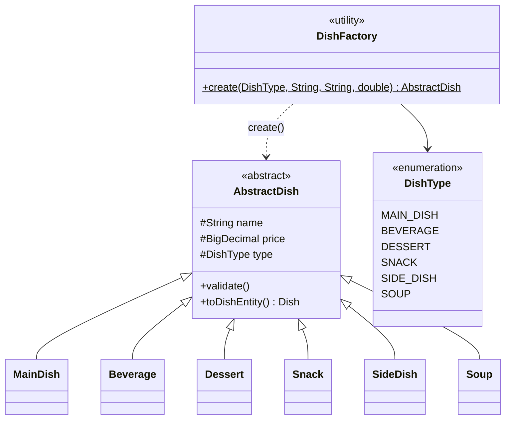

---

## 6. 数据表设计

### 6.1 E-R 关系概览

**图 6-1 数据库 E-R 图**

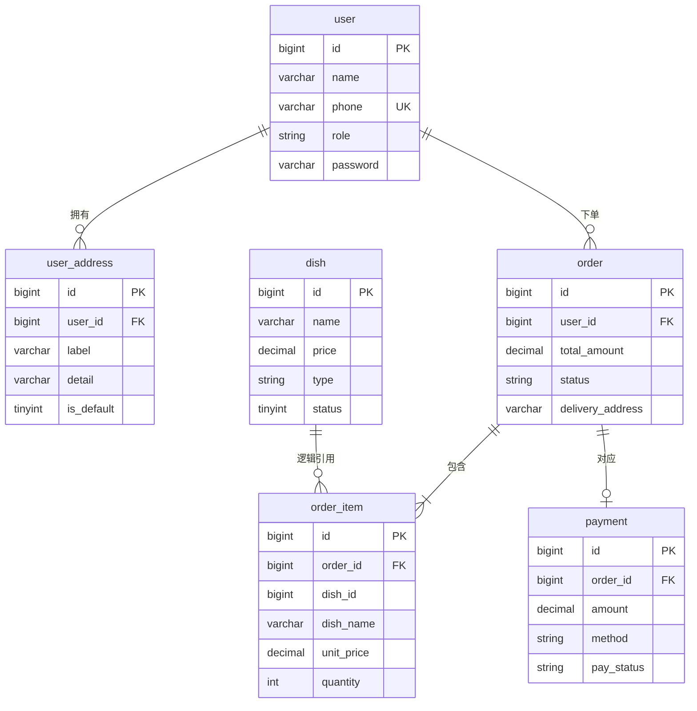

### 6.2 表结构说明

#### （1）`user` — 用户表

| 字段 | 类型 | 说明 |
|------|------|------|
| id | BIGINT | 主键 |
| name | VARCHAR(50) | 姓名 |
| phone | VARCHAR(20) | 手机号，唯一索引 |
| role | ENUM | `USER` / `MERCHANT` |
| password | VARCHAR(100) | BCrypt 哈希 |

#### （2）`user_address` — 收货地址表

| 字段 | 类型 | 说明 |
|------|------|------|
| id | BIGINT | 主键 |
| user_id | BIGINT | 所属用户 |
| label | VARCHAR(50) | 标签（家、公司等） |
| detail | VARCHAR(200) | 详细地址 |
| is_default | TINYINT(1) | 是否默认 |

支持一个用户保存多个地址，下单时选择地址，订单记录 `delivery_address` 文本快照。

#### （3）`dish` — 菜品表

| 字段 | 类型 | 说明 |
|------|------|------|
| id | BIGINT | 主键 |
| name | VARCHAR(100) | 菜品名称 |
| price | DECIMAL(10,2) | 价格 |
| type | ENUM | 六种菜品类型 |
| status | TINYINT(1) | 1=上架，0=下架 |

`type` 字段与工厂模式中的 `DishType` 枚举一一对应。

#### （4）`order` — 订单主表

| 字段 | 类型 | 说明 |
|------|------|------|
| id | BIGINT | 主键 |
| user_id | BIGINT | 下单用户 |
| total_amount | DECIMAL(10,2) | 订单总金额 |
| status | ENUM | 六种订单状态，对应状态模式 |
| remark | VARCHAR(200) | 备注 |
| delivery_address | VARCHAR(200) | 配送地址快照 |

`status` 存枚举字符串（如 `PENDING_PAYMENT`），运行时由 `resolveState()` 还原为 `OrderState` 对象。

#### （5）`order_item` — 订单明细表

| 字段 | 类型 | 说明 |
|------|------|------|
| order_id | BIGINT | 所属订单 |
| dish_id | BIGINT | 菜品 ID（逻辑引用） |
| dish_name | VARCHAR(100) | 菜品名称**快照** |
| unit_price | DECIMAL(10,2) | 单价**快照** |
| quantity | INT | 数量 |
| size | ENUM | SMALL / LARGE |
| extras | VARCHAR(500) | 加料 JSON |

对菜品信息做**快照**存储，避免菜单变更影响历史订单，体现建造者模式产出值对象的持久化方式。

#### （6）`payment` — 支付记录表

| 字段 | 类型 | 说明 |
|------|------|------|
| order_id | BIGINT | 唯一约束，一笔订单一条支付 |
| amount | DECIMAL(10,2) | 支付金额 |
| method | ENUM | WECHAT / ALIPAY |
| status | ENUM | PENDING / SUCCESS / FAILED |
| transaction_id | VARCHAR(100) | 第三方流水号 |

### 6.3 设计要点总结

| 要点 | 说明 |
|------|------|
| 快照策略 | `order_item` 冗余 `dish_name`、`unit_price`，保证历史数据不受菜单变更影响 |
| 状态持久化 | 仅存 `status` 字符串，状态对象运行时重建 |
| 地址快照 | `order.delivery_address` 下单时写入，与用户地址表解耦 |
| 角色字段 | `user.role` 支持 JWT 鉴权中的角色判断 |

---

## 7. 前端应用开发介绍

### 7.1 双端拆分

系统包含两个独立 Vue 3 前端应用：

| 应用 | 端口 | 主要页面 |
|------|------|----------|
| `frontend-client` | 5173 | 登录、注册、菜单、购物车、结算、我的订单、我的地址、账户设置 |
| `frontend-admin` | 5174 | 登录、订单看板、菜品管理、支付流水 |

前端通过 Axios 调用后端 API，JWT Token 存储在 `localStorage`，请求拦截器自动附加 `Authorization: Bearer <token>` 头。

### 7.2 用户点餐端主要页面

| 页面 | 路由 | 功能 |
|------|------|------|
| 登录 / 注册 | `/login`、`/register` | JWT 认证，注册含确认密码 |
| 菜单 | `/menu` | 菜品列表、分类筛选、搜索（无需登录可浏览） |
| 购物车 | `/cart` | 管理待下单菜品 |
| 结算 | `/checkout` | 选择收货地址、填写备注、提交订单 |
| 我的订单 | `/orders` | 查看订单列表与状态 |
| 订单详情 | `/orders/:id` | 查看明细、支付、取消 |
| 我的地址 | `/addresses` | 多地址增删改、设默认 |
| 账户设置 | `/profile` | 修改姓名、手机号、密码 |

> **【图 7-1：用户点餐端菜单页面截图（建议插入）】**  
> 展示菜品分类筛选与搜索栏。

> **【图 7-2：用户点餐端结算页面截图（建议插入）】**  
> 展示收货地址选择与订单明细。

> **【图 7-3：用户点餐端订单详情页面截图（建议插入）】**  
> 展示订单状态、配送地址与支付按钮。

> **【图 7-4：用户点餐端我的地址页面截图（建议插入）】**  
> 展示多地址列表与默认地址标记。

### 7.3 商家后台主要页面

| 页面 | 路由 | 功能 |
|------|------|------|
| 登录 | `/` | 商家账号登录 |
| 订单看板 | `/orders` | 按状态分列展示，含收货地址 |
| 菜品管理 | `/dishes` | 搜索、编辑、上下架 |
| 支付流水 | `/payments` | 查看支付记录 |

> **【图 7-5：商家后台订单看板截图（建议插入）】**  
> 展示按状态分组的订单卡片与操作按钮。

> **【图 7-6：商家后台菜品管理截图（建议插入）】**  
> 展示菜品列表、搜索与编辑弹窗。

### 7.4 前端组件设计

| 组件 | 位置 | 说明 |
|------|------|------|
| `AuthLayout` | 两端共用 | 登录/注册页统一布局 |
| `PasswordInput` | 两端共用 | 密码输入框，内置眼睛图标切换明文/密文 |
| `AdminOrderTicket` | 商家端 | 订单卡片，按状态显示操作按钮 |
| Pinia Store | 两端 | `useAuthStore` 管理 Token；客户端另有 `useCartStore` |

---

## 8. 开发中遇到的问题与解决方案

### 8.1 登录接口返回 401「未登录或 Token 已过期」

**现象：** 用户调用 `POST /api/client/auth/login` 登录，尚未获取 Token，却收到 401 错误。

**原因分析：** Spring Security 只配置了一条业务 API 过滤链，登录接口 `/api/client/auth/login` 也被 JWT 过滤器拦截。由于请求未携带 Token，过滤器直接返回 401。

**解决方案：** 配置**两条独立的 `SecurityFilterChain`**：

1. `@Order(1)` 认证链：匹配 `/api/client/auth/**` 和 `/api/admin/auth/**`，`permitAll()`，不经过 JWT 过滤器
2. `@Order(2)` 业务链：其余 API 走 JWT 鉴权与角色控制

同时在 `JwtFilter` 中对认证路径调用 `shouldNotFilter()` 跳过过滤。

**图 8-1 Spring Security 双过滤链配置示意图**

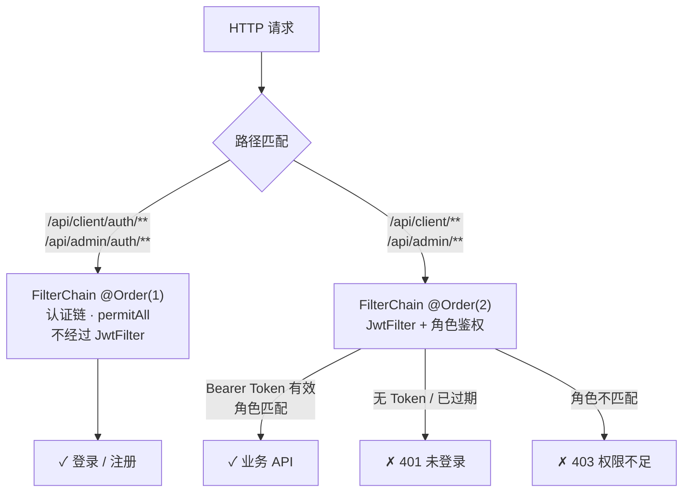

---

### 8.2 演示账号密码无法登录

**现象：** 使用种子数据中的演示账号登录，提示「手机号或密码错误」。

**原因分析：**

1. 已有 MySQL 数据卷在拆分前创建，缺少 `role`、`password` 字段
2. `init.sql` 中的 BCrypt 哈希与当前运行环境的加密结果可能不一致

**解决方案：**

1. 编写 `migrate-auth.sql`，为已有库添加 `role`、`password` 列并插入演示数据
2. 新增 `DemoAccountInitializer`，在应用启动时用 `PasswordEncoder` 重新编码并写入演示账号密码，保证哈希与运行环境一致
3. 对未迁移的数据库用 try-catch 包裹，输出警告而非崩溃

---

### 8.3 JJWT 依赖版本导致编译失败

**现象：** Maven 编译报「找不到符号」，JJWT 相关类无法解析。

**原因分析：** `pom.xml` 中指定的 JJWT 版本 `0.12.6` 在 Maven Central 上不可用或 API 有变。

**解决方案：** 将 JJWT 版本降为 `0.12.3`，并修正 `JwtUtil` 中的 import 语句（使用 `io.jsonwebtoken.security.Keys` 等显式导入），确保与 API 一致。

---

### 8.4 中文乱码问题

**现象：** 数据库中或 API 响应出现中文乱码。

**原因分析：** 数据库连接、表字符集或 HTTP 响应编码未统一为 UTF-8。

**解决方案：**

1. MySQL 建库语句指定 `utf8mb4` 字符集与 `utf8mb4_unicode_ci` 排序规则
2. `application.yml` 中 JDBC URL 添加 `characterEncoding=utf-8`
3. Spring Security 异常响应设置 `Content-Type: application/json;charset=UTF-8`

---

### 8.5 密码框出现两个眼睛图标

**现象：** 登录页密码输入框右侧同时出现两个眼睛图标。

**原因分析：** 自定义 `PasswordInput` 组件在输入框内添加了切换按钮，而 Edge 等浏览器对 `type="password"` 的输入框会自动渲染原生「显示密码」按钮（`::-ms-reveal`）。

**解决方案：** 在 `PasswordInput` 组件样式中隐藏浏览器原生按钮：

```css
.password-field input::-ms-reveal,
.password-field input::-ms-clear {
  display: none;
}
```

保留统一的自定义眼睛图标，保证双端视觉一致。

> **【图 8-2：密码框双图标问题与修复后效果对比截图（建议插入）】**  
> 左：修复前（两个图标）；右：修复后（仅自定义图标）。

---

### 8.6 注册要求地址与多地址需求矛盾

**现象：** 早期注册流程要求填写收货地址，但业务上用户应有多个地址。

**解决方案：**

1. 注册时移除地址字段，仅收集姓名、手机号、密码（含确认密码）
2. 新增 `user_address` 表与 `ClientAddressController`，支持多地址 CRUD
3. 结算页加载地址列表供用户选择，订单写入 `delivery_address` 快照
4. 编写 `migrate-address.sql` 将旧 `user.address` 数据迁移至 `user_address`

---

## 9. 测试与验证

### 9.1 单元测试

后端为每种设计模式编写了单元测试，执行 `mvn test` 即可运行：

| 测试类 | 验证内容 |
|--------|----------|
| `OrderStateTest` | 各状态允许/拒绝的操作、状态迁移正确性 |
| `OrderServiceTest` | 下单后初始状态为 `PENDING_PAYMENT`、金额计算 |
| `CustomDishBuilderTest` | 链式调用、quantity 校验 |
| `PaymentStrategyTest` | 微信/支付宝策略返回结果 |
| `DishFactoryTest` | 各类型创建、validate 拦截非法输入 |

### 9.2 功能验证场景

| 场景 | 操作步骤 | 预期结果 |
|------|----------|----------|
| 菜品创建 | 商家后台新增「主食」类型菜品 | 经工厂校验后入库，`type=MAIN_DISH` |
| 定制下单 | 用户选择大份+加辣下单 | `order_item` 记录 size、extras |
| 支付 | 对待支付订单发起微信支付 | 支付成功，订单状态变为 `PAID` |
| 履约 | 商家依次接单、配送、完成 | 状态按迁移表正确流转 |
| 非法操作 | 对已完成订单调用 cancel | 抛出 `IllegalStateException` |

> **【图 9-1：单元测试运行结果截图（建议插入）】**  
> 展示 `mvn test` 全部通过的终端输出。

> **【图 9-2：订单状态流转演示截图（建议插入）】**  
> 建议拼接用户端与商家端在同一订单不同阶段的截图。

---

## 10. 总结与体会

### 10.1 设计模式应用总结

本课程设计在 OrderSys 外卖订单系统中成功落地了四种 GoF 设计模式：

- **状态模式**将订单生命周期规则从 Service 层剥离，新增状态只需增加实现类，符合开闭原则
- **建造者模式**以链式 API 优雅组装多可选参数的订单项，保证对象不可变与校验前置
- **策略模式**将支付渠道解耦，Mock 实现便于教学，真实网关接入只需新增策略类
- **工厂模式**统一菜品创建入口，子类扩展不影响调用方

四种模式通过 `PaymentService → OrderService.markPaid()` 等**桥接点**协作，形成完整的业务链路，且各自职责清晰、互不侵入。

### 10.2 Spring 框架体会

Spring Boot 提供了 IoC 容器、声明式事务、Security 过滤器链等基础设施，使开发者可以专注于**领域模型的设计**。本项目中：

- 构造器注入保证了 Service 层依赖清晰、可测试
- `@Transactional` 简化了订单创建、支付等跨表操作的事务管理
- 双 `SecurityFilterChain` 体现了过滤器链思想在认证场景下的灵活运用

Spring 与应用层设计模式并非替代关系，而是**互补关系**：Spring 解决基础设施问题，GoF 模式解决业务建模问题。

### 10.3 不足与展望

在支付方面，当前策略模式采用的是 Mock 实现，仅生成模拟流水号，尚未对接真实的微信或支付宝 SDK。后续可将 `WechatPayStrategy`、`AlipayStrategy` 替换为调用官方网关的实现，而上层的 `PaymentService` 与 `PaymentContext` 无需改动，这正是策略模式带来的扩展便利。

在异常处理方面，部分接口仍在 Controller 或 Service 中通过 `Result.error()` 返回错误信息，尚未统一使用 `@ControllerAdvice` 做全局异常映射。后续可集中处理 `IllegalStateException`、`IllegalArgumentException` 等异常，减少重复代码，并让前端收到格式一致的错误响应。

在状态持久化方面，订单状态仅以字符串存入数据库，每次加载时需通过 `resolveState()` 重建状态对象，且缺少状态变更的历史记录。后续可考虑增加订单状态审计表，记录每次迁移的操作者、时间与前后状态，便于追溯与对账。

在前端方面，目前依赖手工功能验证，尚未引入自动化测试。后续可使用 Playwright 等工具编写端到端测试，覆盖登录、下单、支付与商家履约等关键路径，提升回归测试效率。

---

*（报告完）*
